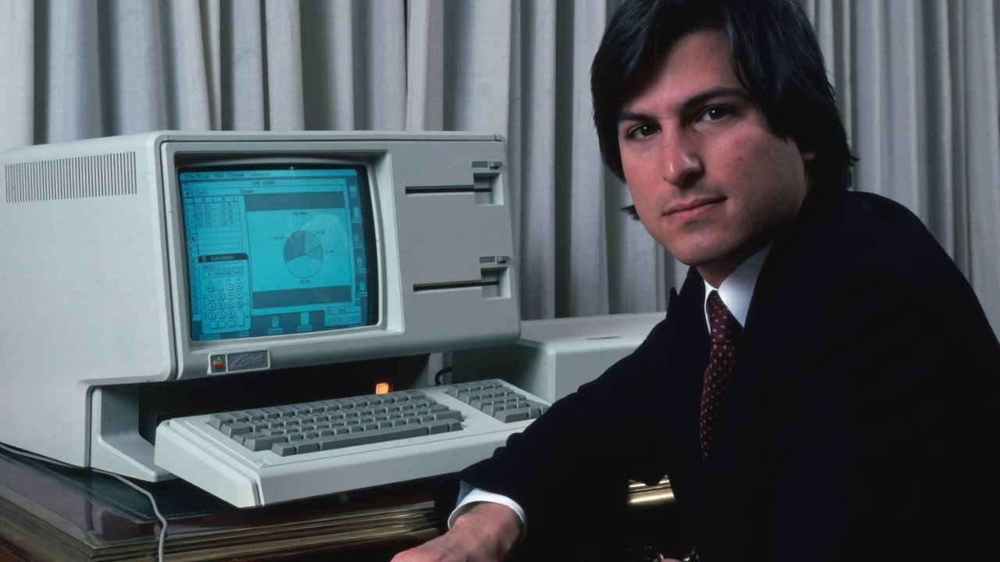
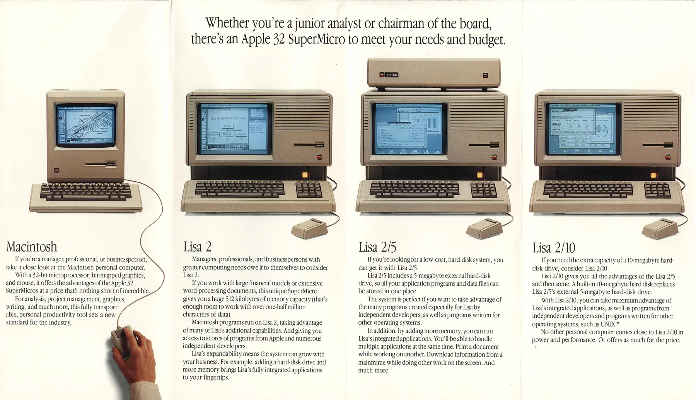
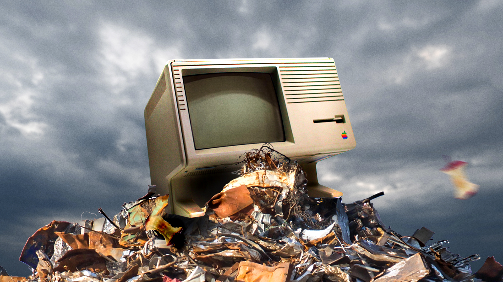
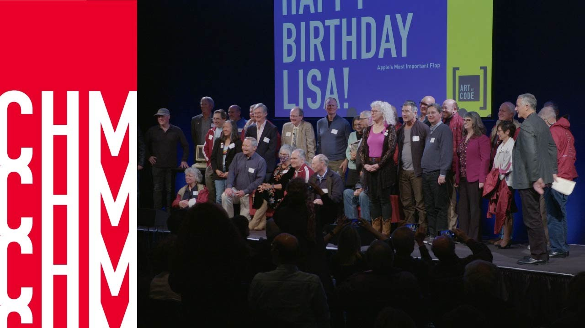
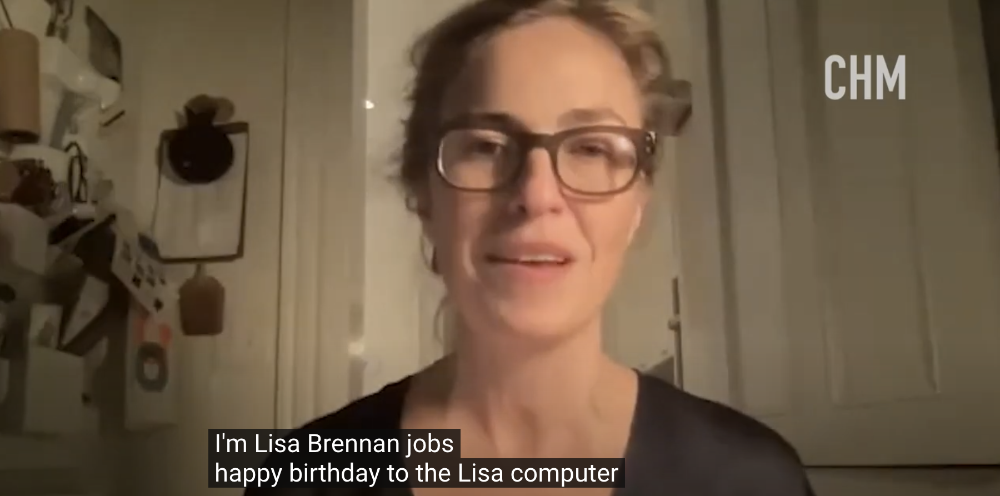

# 追赶乔布斯的岩田聪03｜我是 Lisa

## 楔子
火车上，
> 我找到了一排有着两个空座的座位，靠着窗边。就在看起来一路通畅，我将独享这一排座位时，来了一个女人（跟我一样年纪？大一点？小一点？）。“我能坐这儿吗？”她问。“没问题，”我说。她有着棕长直的秀发，刘海刚好垂到眉梢。她戴着一副大黑框眼镜，穿着一件黑色短外套，内搭一件格子裙，配上黑色紧身裤。一坐下来，她就从包里取出了她的 Kindle，开始读起来。现在这些 Kindle 和 iPad，让人没法再偷偷看封皮了；我们失去了根据手中的书来评估陌生人的能力。它都没有封面了，你还怎么根据封面来判断一本书呢？
> 
> （略）
> 
> “你在读什么？”我自己听着我的声音似乎太大了，还升高了音调。
> 
> 她抬起头来。“完全是逃脱现实的垃圾文学，”注视着我，“我叫 Lisa”。
> 
> “很高兴认识你，Lisa，”我回答说，完全忘了回复我的名字。“你的名字不会是照着电脑取的吧？”我问道，凭着一股直觉。
> 
> “对咯，就是啊！”她告诉我她是在 1983 年出生的，那一年 Lisa 电脑才刚刚推出。她的父母在苹果公司相识。
> 
> “幸好不是在 1984 年生的啊，”我说。她咯咯笑了，是那种轻轻柔柔的。“是啊，要不我的名字会是 Macintosh！”我们的眼神交会，但我又缩了回去。她回到了自己的电子书上。[^boy]
## Lisa 来了

在 Macintosh 发布的前一年，1983年1月19日苹果发布了 Lisa。它被认为是第一台可通过图形用户界面 （GUI） 操作的大众市场个人计算机。

1983 年，像 Lisa 这样的机器仍然非常昂贵，以至于它主要销售给个人和中小型企业，作为更大、更昂贵的大型机或小型计算机（如 IBM）的开创性新替代品。原来这些大型机或小型计算机要么需要供应商提供额外的、昂贵的咨询，要么雇用经过专门培训的人员，或者至少，维护和操作的学习曲线要陡峭得多。

为了更好的推广 lisa，
> 1982 年秋天，苹果公司砸下重金请一家营销顾问公司为 Lisa 和 Macintosh 设计一套主题名字。他们想出了一大堆名字，例如把 Macintosh 叫作“苹果40”或“极速苹果(Apple Allegro)”。乔布斯和营销团队听完所有的建议后，决定还是以 Lisa 和 Macintosh 作为正式的名字。他们还把 Lisa 作为“本地集成系统架构”(Local Integrated Systems Architecture)的简称，但我们在内部还是喜欢用“Lisa：愚蠢的缩写”(Lisa: Invented Stupid Acronym)或是类似的叫法来开Lisa的玩笑。[^hertzfeld]

Lisa 的开发始于 1978 年，也正是那一年乔布斯的第一个孩子出生了。孩子的母亲是克里斯安·布伦南（Chrisann Brennan），但乔布斯不承认自己是孩子的生父。

那年春天，在俄勒冈，在父母共同的朋友罗伯特的一个农场里，在两位产婆的帮助下，孩子出生了。几天过后，乔布斯来了。他们把孩子抱到田间，放在一块毯子上，然后一起查看宝宝起名书。乔布斯想取名“克莱尔”，他们俩看了好几个名字，始终无法达成一致。他们不想要缺乏独创性的名字，最好是一个长名字的减缩版。

“叫丽莎怎么样？”克里斯安·布伦南最后问道。“好，就叫这个了。”乔布斯高兴地回答道。第二天，乔布斯就走了。

丽莎后来问母亲，“可是他不承认是我的父亲，你又为什么要让他帮忙取名字？” “因为他本来就是你父亲。”母亲答道。[^lisa]

## 挫败

Lisa 上市后并不顺利。高昂的价格、不稳定的性能以及 Macintosh 的冲击。1984 年，在 Macintosh 推出的同时，Lisa 2 发布。Lisa 2 系列由两种型号组成：Lisa 2/5 和 2/10，售价分别为 3495 美元和 5495 美元。1985 年 1 月，Lisa 2/10 被更名为 Macintosh XL，并配备了 MacWorks（一种允许其运行 Mac 软件的模拟器），但尽管销量有所提高，该产品还是于 1985 年被淘汰。

丽莎已经在读小学了，一次班里搞了个活动，名叫“猜数字”，让学生们猜罐子里玉米粒的数量。丽莎连续两次以全班最小的误差猜中了大概的数字。其实她只是在纸上写了几个数，她还不认识个、十、百、千的计数单位。母亲来接她放学时，老师把这件事告诉了她，她们俩都以诧异的眼神看着她，仿佛这是个神童。一周之后，她写的一首诗被选中，刊登在学校的周报上：“美丽的朝圣者，伟大的朝圣者，他们乘着五月花号，踏上我们这片土地。”一切好像水到渠成，她变成了自己梦想中的样子：像父亲一样有名并且幸运。

> 不久之后，父亲给我送来一台麦金塔电脑。他把箱子从汽车后座上拖出来，搬进我的房间，将其放在地板上。他看了看箱子，说道：“该怎么打开呢？”似乎他真的不知道，我禁不住怀疑他是不是这台电脑的发明者。
> 
> 房间里光亮的木地板上，只有儿童床这一件家具，平行四边形样的光从窗户里射进来，点点浮尘像半空中微小的火星。
> 
> 他抓住顶部的把手，将电脑拉了出来，放在地上，靠近墙上的电源插座。
> 
> 他抓起电源线，似乎很眼生的样子，说道：“我猜，应该把它插进去。”
> 
> 他盘腿席地而坐，我则跪坐在他身边。他找到电脑的电源开关，按下开关，电脑启动，屏幕中央出现一张电脑的笑脸照片。接下来，他教我如何用电脑画画，画完后如何保存，然后他就离开了。
> 
> 他对另一款电脑——Lisa——只字未提。我担心他并未以我的名字命名电脑，担心那只是个误解。[^lisa]

## 宿命

1985 年，苹果的一家经销商 Sun Remarketing 从苹果购买了 7000 台未售出的 Apple Lisa 电脑。Sun Remarketing 的创始人 "Bob" Cook，回忆道，有一天，苹果市场部副总裁 Bill Campbell 给他打电话说，听说你卖 Apple III 卖的不错啊，我们有些库存的 Lisa，你也拿去吧。Bob 谈妥了价格，产品以寄售方式交易，Bob 觉得这样没什么风险，接受了它们。[^before]

Sun Remarketing 又从苹果那里购买了 MacWorks XL 仿真器，通过使 Lisa 计算机能够运行 Macintosh 应用程序来刺激 Lisa 计算机的销售。随着 Apple 推出具有增强型 128K ROM 的 Macintosh Plus，许多新的 Macintosh 应用程序不再在 MacWorks XL 下运行。为了清理剩余的库存，Sun Remarketing 采取了大胆的步骤，包销了一款名为 MacWorks Plus 的新模拟器的开发，该模拟器完全支持 Lisa 硬件上的 128K ROM，最后被打包称 Lisa Professional。Sun Remarketing 单枪匹马地创造了一个全新的电脑市场。在 1985 年至 1989 年间售出了大约数千台 Lisa。

1989 年 Bob 接到了一个来自苹果的电话，一位律师说到，‘我们决定行使合同中的条款，收回我们所有的电脑’。苹果突然收回了剩余的 2700 台 Lisa，留给了 Bob 几百台半成品。他们花了几天的时间才把所有的东西装好并运到垃圾填埋场。Bob 去了垃圾填埋场，看到他们拿着相机在那里，他们正在拍摄整个过程。他们付给垃圾填埋场的工作人员额外的钱，让他们在垃圾填埋场碾压它们，他们把这一切都拍下来了。一名垃圾填埋场员工认为这件事具有新闻价值，并给当地报纸打了电话。那天 Bob 非常沮丧，还偷偷溜上卡车去拿回一些鼠标和内存板。[^before]

初中即将结束时，丽莎和母亲的矛盾已近白热化时，学校给乔布斯打过电话，说如果他不收留丽莎的话，那么学校就会联系社会服务，对她进行托管。

> “不是暂时的，”他说道，“如果你想跟我们住，就得做出选择：是要你妈妈还是要我们，我需要你真正给这个家一个机会。如果你选择跟我们住，那就要承诺半年内不跟你妈妈见面。你得真的离开她。”他如此说道。我不能两头来回跑，这样他是不会接受的。他认为彻底了断才是正确的做法。母亲不同意，但父亲是强势的一方，这是他的条件，如果不接受，我就不能跟他一起生活。当时已临近暑假，也就是说，如果我同意父亲的条件，我将在12月之前不能见到母亲，“否则的话就免谈。”他如此说道。
> 
> “我想跟你一起住。”我信誓旦旦地说。
> 
> “你刚刚做出了一个重大的抉择，”他一本正经地说道，“这是你人生的重要转折点，是成熟的表现。[^lisa]

和乔布斯同住后，在一天开车回家的路上，

> 我终于鼓起勇气问他Lisa电脑是否以我命名。我等了很多年，就是想等这样一个与他单独相处的机会，问他这个问题。倘若他的回答是否定的，我也不至于当着外人的面丢脸。
> 
> “那个，你做的那个电脑，Lisa……”
> 
> “怎么了？”他问道。
> 
> “是不是以我命名的？”我问道。我们俩都直视前方，我没有看他，语气听起来只是好奇而已，没有别的想法。
> 
> 其实我真希望他能给我这份荣耀。
> 
> “不是。”他回答我，语气简单明了而且仿佛不屑一顾，似乎我是在诈取他的称赞。“抱歉了，孩子。”
> 
> “那就是我想错了。”我应道。我很庆幸，因为那时他没有转头看我的脸。[^lisa]

从此丽莎似乎不太愿意再提这事，不过一天下午，继母劳伦娜下班回家。

> 我到外面迎接她，她在大门旁的玫瑰丛边上。
>
> “你知道那台电脑吗？型号是 Lisa 的？”她问我。她把大门关“关上，门上的铃铛叮当作响，她的头发在夕阳下闪闪发光，她背着一个牛皮小背包。“那是以你的名字命名的，对吧？”之前我从未跟她谈这个话题，我不知道她为什么这么问。或许是某个同事向她提及此事了。
>
> “我不知道，我想是的。”我撒谎道，我希望她别再追问了。
>
> “一定是的。”她说道，“等他回来了，咱们俩问问他。”
>
> “不是什么大事儿。”我说。我不想再听他回答一次了。可是，或许劳伦娜问的话，他的回答会不一样？
>
> 几分钟之后，父亲回来了。他从门外进来，劳伦娜上前迎着他，我也跟了过去。”
> 
> “亲爱的，”劳伦娜说道，“那台电脑是以丽莎命名的吧？”
> 
> “不是。”他答道。
> 
> “真的？”
> 
> “真的。”他答道。
> 
> “少来了。”她看着他的眼睛。我很震撼，也对她心怀感激，因为她决定打破砂锅问到底，换作是我，早就放弃了。在大门到屋门之间的路上，他们俩面对面站着。
> 
> “真的不是。”父亲再次说道。
> 
> 接着我又后悔了，我真希望劳伦娜没问。我替她感到尴尬，她原以为我对他很重要，却发现并非如此。
> 
> “那么，你是以谁命名的呢？”劳伦娜继续问道。”
> 
> “一个前女友。”父亲答道。说到这，他眺望远处，做出沉思状，似乎是在回忆。看着他恍惚的样子，我相信他说的是实话，否则他的演技也太好了。我有种奇怪的感觉，每当感觉有假时就会这样。但最近这种感觉太过频繁，我开始怀疑自己的第六感出了错，是一个误会。再说了，他何必要撒谎呢？他的真实情感是对另一个丽莎的。从他年轻时至今，我从未听说他有过一个名叫丽莎的女友，我向母亲求证，她说：“废话，当然没有。”可是，或许她也不知道呢？或许跟那个丽莎的事，他自始至终都瞒着我们母女。
> 
> “孩子，对不起。”他说道，拍了拍我的后背，走进屋里。[^lisa]

## 尾声

Sun Remarketing 开始退出 Lisa 业务时，VintageMicros 的 John Woodall 询问他们是否会考虑将剩下的所有东西一起出售。他们同意了，谈好了价格，就用牵引拖车运送它们，有好几个托盘。2024 年的纪录片中，John 说自己还剩下大约 30 台 Lisa。最高峰时，至少有 150 台。那时租了两个储藏室，里面除了 Lisa 和 Lisa 零件之外什么都没有。

John 还通过学校的收购和其他收藏家得到了Lisa电脑，他修复会并出售它们。有一次机会，他从德克萨斯卡罗尔顿的老 Lisa 工厂获得一些库存。那里的一个人在达拉斯买了一批库存并储存起来。John 与他达成了交易，去那里租了一辆大货车，把它们运回来，大概带回了 60 或 70 台和各种备件。从此 John 真正开始做这件事，修理并出售了相当一部分的 Lisa。[^before]

随着老式电脑慢慢变得越来越受欢迎，Lisa 成为一种收藏品。

2023 年 1 月 31 日，CHM（计算机历史博物馆），举办了一场 Lisa 的 40 周年纪念活动。这是一个在线活动，由 CHM 的 CEO Dan'l Lewin 主持，他邀请了一些曾经参与 Lisa 开发的工程师和设计师，以及其他人，来分享他们的经历和回忆。本文开头的小说片段，便是作者 Katie Hafner 在活动上分享给大家的。

活动到尾声时，播放了一段来自丽莎的祝福视屏，
> 大家好，我是丽莎·布伦南-乔布斯。祝丽莎电脑生日快乐。很抱歉我今天不能去那里，但我在纽约。我们都知道 Lisa 计算机是以“本地集成系统架构”命名的，我们共享一个名字真是太疯狂了。祝丽莎 40 岁生日快乐。[^40th]

## ONE MORE THING
2005 年，27岁时，丽莎去了伦敦的一家图形设计公司。乔布斯邀请丽莎一起乘游艇到地中海玩，同去的还有劳伦娜、弟弟、妹妹，还有一位保姆。在法国南部海岸，乔布斯说要在滨海阿尔卑斯省（Alpes-Maritimes）稍作停留，他要跟一个朋友共进午餐，但他却不说那人是谁。他们坐着一艘小艇上岸，又坐面包车去了埃兹小镇的一栋别墅。

乔布斯要见的朋友原来是保罗（Paul David Hewson，爱尔兰摇滚乐团U2的主唱兼旋律吉他手，艺名波诺。）他们在靠海的一个大封顶阳台上吃午饭，丽莎跟父亲之间隔着几个座位，他和保罗并肩坐在餐桌的一端。

> 保罗问父亲苹果公司开创时的情况。比如，当初创立时，团队是否有朝气，他们是否胸怀大志、准备改变世界？父亲回答，在制造“麦金塔”电脑时，他们的确是这种心态。波诺说，当初他和自己的乐队也是如此。两个不相干领域的人，竟然有着相同的体会，真是神奇。接着保罗问我父亲：“那台电脑Lisa，是不是以她命名的？”保罗看了看我。
> 
> 一时间，世界变得静悄悄的。我坐稳了，安静地等着父亲回答。
> 
> 父亲犹豫了一下，低头看着自己眼前的盘子。过了一会儿，他回答说：“是的。”
> 
> 听到这句话，我直接站了起来。
> 
> “我想也是。”保罗说。
> 
> “对。”父亲回应他。
> 
> 我看着父亲的脸。这到底发生了什么？这么多年过去了，他为什么现在才承认？Lisa 当然是以我的名字命名的，我当时如此想道。现在看来，他以前说的谎言简直荒谬可笑。我觉得听到这句话后，自己强大了很多，挺直了胸膛。
> 
> “这是他第一次承认这件事，”我对保罗说，“谢谢你能开口问他。”似乎，一个名人的秘密，需要另一个名人才能打开。[^lisa]

[^before]: [Before Macintosh: The Apple Lisa](https://vimeo.com/ondemand/beforemacintosh)
[^40th]: [CHM Live | Happy 40th Birthday Lisa!](https://www.youtube.com/watch?v=oCvQbGXPtBU)
[^boy]: [The Boys, by Katie Hafner, July 26, 2022 by Spiegel & Grau](https://www.goodreads.com/book/show/60473858-the-boys)
[^lisa]: 丽莎·布伦南·乔布斯. “小人物：我和父亲乔布斯.”
[^hertzfeld]: Andy Hertzfeld. “硅谷革命：成就苹果公司的疯狂往事.”