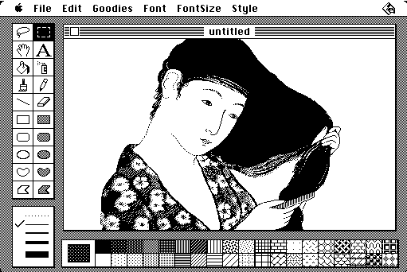
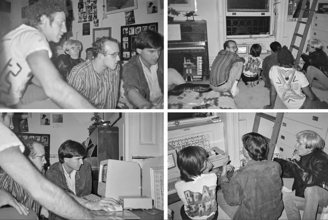
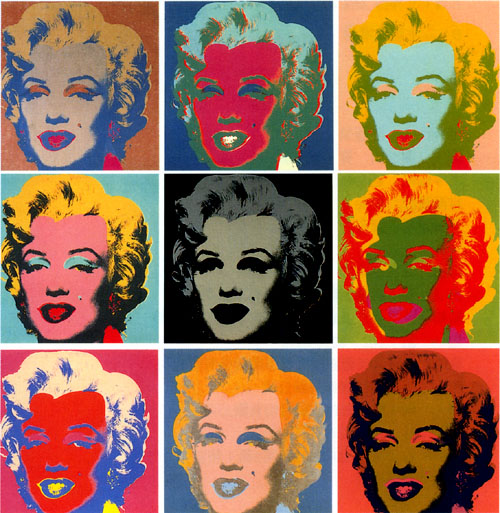
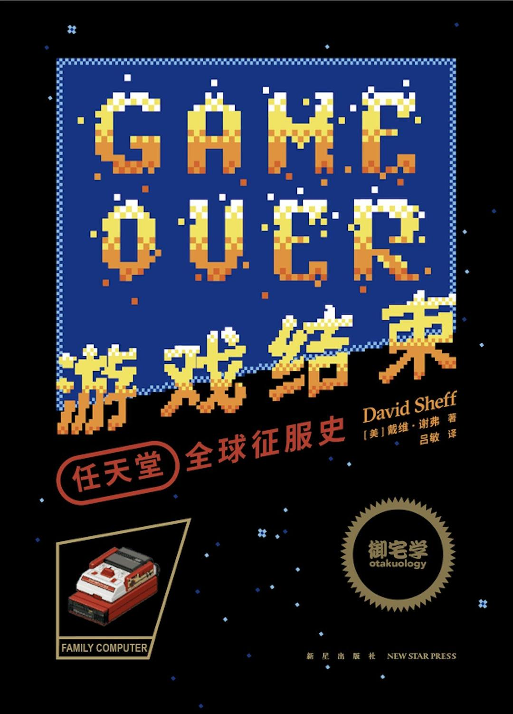

# 追赶乔布斯的岩田聪04｜我画了一个圈圈！

_“我画了一个圈圈！” —— 安迪·沃霍尔[^0]_

在岩田和金田第一次见到 Macintosh 的差不多时间，也就是 Macintosh 发布的几个月后。[^first]

## 派对

那一年的 10 月后乔布斯到了纽约，为了给他纽约的房子搞装修，他请来了贝聿铭[^b]，贝聿铭从来不搞个人住宅，但是，没有人会对乔布斯说不。在纽约的史蒂夫给 Sheff 打了个电话，那天晚上 Sheff 正有安排，去参加肖恩·列侬（约翰·列侬[^john]和小野洋子的儿子）的生日派对。Sheff 打电话问小野洋子否可以带史蒂夫一起去。小野洋子说会很高兴见到乔布斯。

乔布斯提着一个大箱子————给刚满九岁的肖恩·列侬的生日礼物，到了生日派对。晚餐结束后，大家再交谈，史蒂夫问肖恩是否想要他的礼物。跟在肖恩身后，到了他的卧室，里面摆满了机器人。史蒂夫打开纸箱，拿出他的礼物。

他趴在电脑前的地板上。它叫 Macintosh，四四方方，米色。史蒂夫打开电脑，肖恩坐在他身边的地板上，盯着六英寸的黑白内置显示器。他看到史蒂夫推着一个烟盒大小的装置，这个装置通过电线沿着地板连接到电脑上。史蒂夫说它叫鼠标。当他引导它前进时，屏幕上的箭头也移动了。史蒂夫将箭头移到画笔的小图片上，然后单击以启动一个名为 MacPaint 的程序。[^1]

他看着肖恩。“你试试，”他说。肖恩控制着鼠标，把小盒子在地板上滚了一圈。史蒂夫说：“现在按住按钮，同时移动它，看看会发生什么。肖恩照做了，一条细细的、锯齿状的黑线出现在屏幕上。肖恩着迷了，说：“酷！他点击鼠标按钮，按下它，屏幕上出现了形状和线条，他删除了（史蒂夫解释了如何使用屏幕上的橡皮擦），然后他画了一种狮子骆驼，然后画了一个他说是男孩乔治的人物。

几个人走进房间，站在肖恩和史蒂夫的身边，看着他们的肩膀。我抬起头。“嗯，”安迪·沃霍尔[^andy]说。“这是什么？看看这个，凯斯。这太不可思议了！凯斯·哈林[^keith]点了点头。艺术家们着迷了，盯着移动的线条。

史蒂夫继续和肖恩一起弄着，沃霍尔和哈林在一旁看着，然后安迪问道：“我可以试试吗？”沃霍尔在电脑前取代了肖恩的位置，史蒂夫教他如何操纵和点击鼠标。安迪不明白;他举起鼠标，挥舞着鼠标，仿佛它是指挥棒。乔布斯温和地解释说，鼠标在沿着表面推动时会工作。沃霍尔一直举起它，直到史蒂夫把手放在沃霍尔的手上，引导它沿着地板。最后，安迪开始画画，盯着屏幕上画画的“铅笔”。

沃霍尔被迷住了——认识他的人都知道，当他被此刻的一切迷住时，他是如何调出一切无关紧要的东西的——滑动鼠标，眼睛贴在显示器上。凯斯弯腰看着。安迪睁大眼睛，抬起头，盯着哈林，说：“看！凯斯！我画了一个圈圈！”

_^ 乔布斯展示 Mac，右下黄发为沃霍尔 [^show]_

半个小时后，艺术家们回到派对上与洋子和其他客人一起出去玩，肖恩离开了一段时间，对洋子进行了采访。当他回来时，他找到了史蒂夫，在晚上剩下的时间里，两人都粘在电脑上。

## 派对结束

在派对结束后，史蒂夫和 Sheff 离开了 …… 他们默默地走了一会儿，Sheff 又提到了派对，那似乎是一个非同寻常的时刻，安迪·沃霍尔兴奋地在Mac上画了一个圆圈。史蒂夫似乎对著名艺术家在 Mac 上画画不感兴趣，而是对肖恩感兴趣。[^andy_dairy]

^ _1967 沃霍尔式的梦露 日本广岛艺术博物馆_

他解释说：“老年人会坐下来问‘这是什么？’，但孩子会问‘我能用它做什么？’”

## 游戏结束

九年后，1993 年 Sheff 出版了一本叫《Game Over（游戏结束）》的书[^nintendo]，主角是另一家公司，同样希望自己的产品能够将快乐带给孩子们 —— 任天堂。

[^0]: 本章主要参考 David Sheff 的 [The Night Steve Jobs Met Andy Warhol](https://www.davidsheff.com/the-night-steve-jobs-met-andy-warhol)，基本上是翻译、摘录和重新组织，第一人称改为第三人称。
[^first]: 见本系列[《追赶乔布斯的岩田聪——个人计算机早期发展史_01_从 EDDY II 到 HALNOTE》](https://mp.weixin.qq.com/s/Ut-j5QsSr--ZBqfeRPevig)
[^b]: 沃尔特《乔布斯传》的记载是贝聿铭事务所的詹姆斯·弗里德(James·Freed)对其进行翻修。
[^john]: 1980 年 12 月 8 日，披头士乐队（The Beatles）的前成员约翰·列侬（John Lennon）在纽约返回他位于达科他公寓内的家途中被枪杀。
[^1]: 沃尔特《乔布斯传》中写到用了 QuickDraw 是有问题的，QuickDraw 是一个库，不是应用程序。绘图软件是 MacPaint。
[^andy]: 作为波普艺术（Pop art）的先驱和核心人物，安迪·沃霍尔 (Andy Warhol) 以日常用品和大众媒体中出现的名人肖像作为主题，创作出历久不衰的影像，并奠定了他的时代。玛丽莲·梦露（Marilyn Monroe）系列为其代表作之一。
[^keith]: 基思·哈林 (Keith Haring)，美国波普艺术家，被誉为“涂鸦艺术之父”。
[^show]: [Steve Jobs Showing off Macintosh to Andy Warhol, Sean Lennon, and Keith Haring in 1984.](https://www.reddit.com/r/VintageApple/comments/tde885/steve_jobs_showing_off_macintosh_to_andy_warhol/) From reddit.com.
[^andy_dairy]: 但是沃霍尔自己的日记可不这么写。“我们进了肖恩的卧室 —— 那里有一个孩子正在设置肖恩得到的苹果电脑，Macintosh型号。我说曾经有个人一直打电话给我，想送我一台，但我从来没有回电话或者什么的，然后那个孩子抬起头说：‘是的，那是我。我是史蒂夫·乔布斯。’他看起来那么年轻，像个大学生。他告诉我他现在还会送我一台。然后他教我如何用它画画。”[_The Andy Warhol Diaries_, Grand Central Publishing, 2009]。另，乔布斯的女儿丽萨在回忆录《小人物》里记录她睡觉前母亲会给她读沃霍尔的日记，但她并不喜欢。
[^nintendo]: 《游戏结束：任天堂全球征服史》，[美] 戴维·谢弗（著），吕敏（译），读库御宅学，新星出版社，2020。关于本书中文版的历史可见笔者发布与“读库小报”微信公众号的[《游戏才刚刚开始》](https://mp.weixin.qq.com/s/cQIc12q7xZAw0X1NiB5A8g)
[^steve]: [Steve Jobs by David Sheff](https://www.davidsheff.com/steve-jobs)
