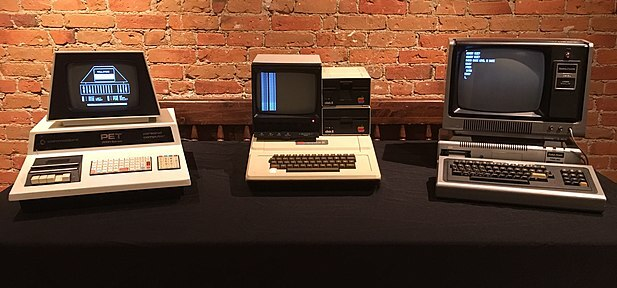
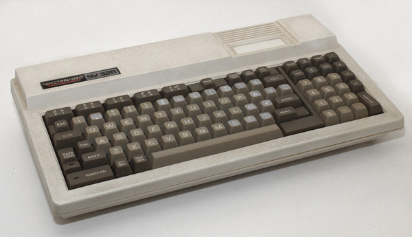
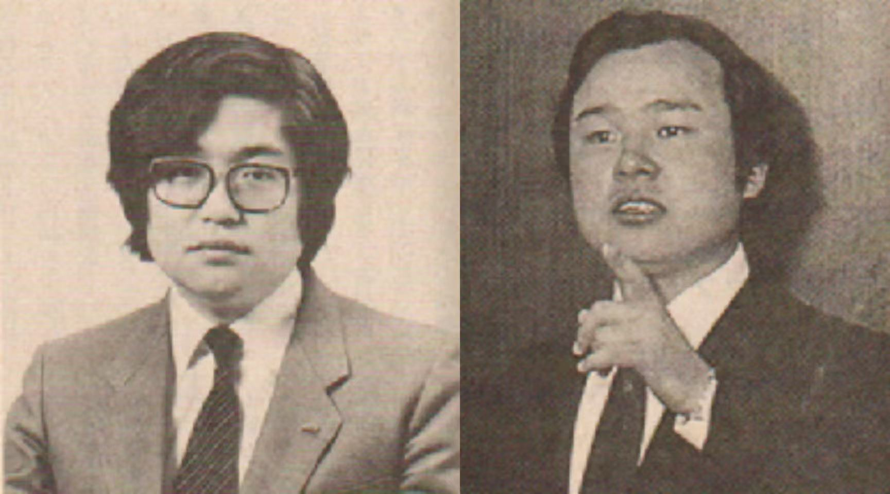
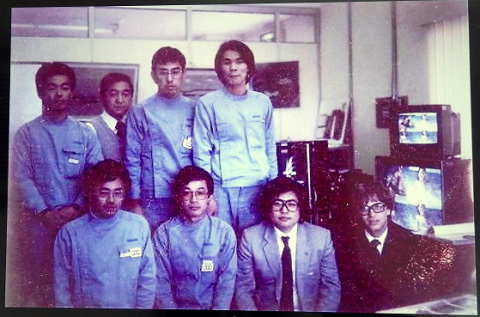

# 追赶乔布斯的岩田聪05｜从御三家到 MSX

## 群雄割据

1984 年，岩田聪和金田猛志在受到 Macintosh 的震撼后，希望能够在 MSX 上实现那个美妙的世界。MSX 到底是什么样的机器呢？

七年前，美国 Commodore、Apple 和 Tandy，在同一年内推出了各自的家用计算机。

*   Commodore 发售了 Commodore PET
*   Apple  推出了 Apple II 
*   Tandy 发布了 TRS-80

后被称为“1977三巨头”（“1977 Trinity”，“1977御三家”）。

_^"1977 Trinity": Commodore PET, Apple II and The TRS-80_

日本也迎来了家用电脑群雄混战的时代。除了电脑厂商外，几乎所有的家电厂商也都参与了这场战争，比如松下、夏普、三洋、日立、东芝、NEC、富士通等等。其中 NEC 处于领先地位。

能否结束这种混乱的局面，统一家用电脑标准？西和彦开始行动了。

## 西和彦

### 童年

西和彦，1956年，出生在日本兵库县神户市。从小就喜欢动手研究。

在西和彦的童年时代，换电视频道可不是一件轻松的事。那个年代的电视机还没有遥控器，需要手动旋转一个旋钮才能切换频道。而这项“苦差事”偏偏经常落到西和彦的头上，这让酷爱科技的他十分苦恼。

为了摆脱换频道的“噩梦”，西和彦绞尽脑汁，想出了不少“奇招”。

* 第一招：晾衣杆大法  西和彦发现，家里的晾衣杆长度正好可以够到电视机的旋钮。于是，他灵机一动，把晾衣杆绑在旋钮上，这样就可以躺在温暖的被炉里，悠闲地换频道了。可惜好景不长，这个“发明”很快就被父亲发现了，结果可想而知，西和彦的屁股遭了殃。
* 第二招：缝纫机改造计划  西和彦的奇思妙想并没有就此止步。他把目光投向了家里的电动缝纫机，心想：如果能把缝纫机的马达连接到电视机上，不就可以用脚踏板控制频道了吗？ 说干就干，西和彦立刻开始拆解缝纫机。这次，父亲的反应却出乎意料。非但没有生气，反而赞赏其儿子的创意，还帮他一起完成了改造。[^reflect_c1]

最终，西和彦的“缝纫机遥控器”大获成功，解放了全家人的双手，也让他体会到了“创意工夫”带来的快乐。虽然这个“神器”后来因为操作不当导致电视机损坏，但这并没有浇灭西和彦对科技的热情，反而让他更加痴迷于探索机械的奥秘。

### 中学

西和彦在高中三年级时，偶然在报纸上看到了“第一届国际电脑艺术展”的消息。 他对“电脑艺术”这个概念感到十分好奇，很想亲眼看看电脑是如何被应用于艺术创作的。

由于展览的举办日期是工作日，西和彦为了去看展，毅然决定逃学。 他住的地方是神户，距离东京很远。他知道如果和父母商量，一定会被拒绝。 于是，他找了个借口提早出门，从上学路上必经的神户三宫车站，偷偷坐上了前往伊丹机场的巴士。 他在机场给学校打电话，说今天请假，虽然是逃学，但他不想对学校撒谎。

西和彦幸运地买到了当天最早航班的机票，票价是正常价格的一半，刚好在他的零花钱承受范围内。他在飞机上补了一觉，醒来时已经抵达了羽田机场。他乘坐单轨列车和山手线到达了有乐町，然后步行前往位于银座索尼大厦的展馆。 

展馆里充满了热烈的气氛，西和彦仔细观赏了各种大型电脑和用电脑创作的艺术作品。他被这些作品深深震撼，感觉“这正是我想做的事情”。他一遍又一遍地在展馆里来回走动，长时间观赏着展品。 也许是因为他太过投入，引起了工作人员的注意，一位来自主办方电脑时代出版社的人主动和他攀谈起来。 

西和彦的热情和真诚打动了这位工作人员，他为西和彦介绍了许多参展者，包括想把电脑作为表达工具的艺术家。 

这次邂逅为西和彦打开了未来之门。他与这些新朋友一直保持联系，并在后来搬到东京后，与其中一些人一起创办了公司。电脑时代出版社还给了西和彦很多兼职工作，让他担任电脑作家，这为日后他创办《月刊 ASCII》杂志埋下了伏笔。[^reflect_c1]

### 比尔
1977 年，正是美国“三大”家用电脑厂商——苹果、Commodore 和 Tandy——在家用电脑市场上大展拳脚的时代。在早稻田大学就读的西和彦与好友一起成立 ASCII 出版公司，创办了《月刊 ASCII》杂志，专注于个人电脑和计算机文化的推广。

1978 年 2 月，西和彦正在大学图书馆里翻阅杂志，突然，一篇关于微软的文章映入眼帘。原来，这家名为“微软”的公司正在销售一款运行在 Intel 8080 处理器上的 BASIC 解释器！而且，这款 BASIC 解释器已经被美国“三大”家用电脑厂商苹果、Commodore 和 Tandy 采用。

西和彦顿时激动起来，他敏锐地意识到，这款 BASIC 解释器很有可能成为未来个人电脑的标准配置！如果能将它用在自己正在构思的个人电脑标准上，那简直太完美了！ 

他迫不及待地想要联系微软的创始人——比尔·盖茨，比西和彦大两岁。但问题是，他手上只有微软的名字，既没有地址，也没有电话号码。西和彦灵机一动，想起了之前为 MITS 公司生产“Altair 8800”电脑的经历。既然微软把 BASIC 卖给了 MITS，那他们应该离得不远吧？ 于是，他大胆地拨打了国际长途，通过人工转接，要求接通“新墨西哥州阿尔伯克基市的微软公司比尔·盖茨”。

幸运的是，西和彦的猜测是正确的，电话竟然真的接通了！不过，比尔·盖茨当时不在办公室。西和彦只好耐心地等待，再次拨打电话。终于，他如愿以偿地和比尔·盖茨通上了话。 西和彦一直尽力不挂断电话，说到：“不管怎样，看看我们公司，我给你寄一张票，所以我想让你来日本。” 比尔轻声回答：“不，我现在很忙。 如果你真的想见面，你可以来美国。那我就去看你。”

对西和彦来说，这可能是一个好的不能再好的“拒绝”。四个月后，他们在加州阿纳海姆举办的全美计算机大会 (NCC) 上会面了。[^reflect_c0]

## MSX

### 标准之争

与比尔·盖茨志趣相投，促成了微软第一个海外销售办事处 ASCII Microsoft 于 1978 年的创建。同时西和彦加入了创业初期的微软，担任董事会成员兼技术副总裁。

1981 年秋，西和彦在 IBM 首台个人电脑 IBM-PC 的开发工作结束后，接到了来自 Spectra Video 的委托，为其开发入门级个人电脑。西和彦在考察了 Spectra Video 的样机后，提出了许多改进意见。Spectra Video 爽快地答应了西和彦的要求，并让他放手去做。

西和彦抓住机会，将 Spectra Video SV-328 的这款入门级个人电脑打造成了 MSX 的原型机。可以说，如果没有 Spectra Video 的委托，MSX 的诞生或许会推迟。

_^Spectra Video SV-328_

西和彦开始四处奔走，游说各大电子厂商加入 MSX 标准。他像个传教士一样，热情洋溢地描绘着 MSX 的美好前景：

* 统一的硬件规格，降低生产成本，让电脑更便宜。
* 统一的软件平台，吸引更多开发者，让用户有更多选择。
* 统一的操作系统，简化使用流程，让电脑更容易上手。

松下电器则是 MSX 最坚定的支持者之一。 松下电器的前田一泰与西和彦是好友，两人经常在一起探讨个人电脑的未来。前田一泰认为，个人电脑市场拥有巨大的潜力，如果能实现统一标准，将带来巨大的商机。他积极支持西和彦的 MSX 构想，并说服了松下电器的高层加入 MSX 阵营。

西和彦最终说服了包括松下、索尼、夏普在内的众多厂商加入 MSX 阵营。据说三丽鸥也曾经考虑过加入 MSX 阵营，推出印有 Hello Kitty 图案的 MSX 电脑。不过，三丽鸥最终还是放弃了这个计划。

然而，1983 年 6 月 9 日，就在 MSX 标准即将发布的前一周，软件大厂“软银”的孙正义突然宣布将联合十几家厂商推出一个与 MSX 对抗的统一标准，这给西和彦和 MSX 带来了巨大的冲击。为了平息这场风波，在松下电器前田一泰的协调下，西和彦与孙正义在 6 月 26 日晚于酒店房间内进行了一场长达四小时的谈判。

谈判从晚上 9 点一直持续到凌晨 1 点，双方就 MSX 标准展开了激烈的辩论。 孙正义认为，微软主导的 MSX 标准不利于日本软件产业的发展，他主张“日本需要自己的软件”。而西和彦则坚持 MSX 标准的开放性和通用性，他相信 MSX 能够促进个人电脑的普及，为用户带来更多利益。

双方都坚持自己的立场，谈判一度陷入僵局。最终，在前田一泰的斡旋下，西和彦做出了让步，同意降低 MSX 的授权费用。作为交换，孙正义放弃了推出对抗标准的计划。

这场谈判最终以和解告终，MSX 标准得以顺利发布。 虽然西和彦在谈判中做出了让步，但他内心仍然感到不甘心。不过，他最终还是选择了顾全大局，以避免个人电脑市场再次陷入分裂。

_^西和彦与孙正义_

多年以后，孙正义在评价西和彦时说：“西和彦在日本个人电脑历史上的作用非常大，如果没有他，日本的个人电脑普及至少会晚一年。”这句话看似是在夸奖西和彦，但“晚一年”的说法却充满了调侃的意味。西和彦则幽默地回应说：“我尊敬的是‘企业家孙正义’，而不是现在的‘投资家孙正义’”。[^reflect_c8]

10月21日，三菱发售 MSX 1号机 “ML-8000”。

### 大事记

1981 至 1984[^30t]

- 1981年
  - 年中：西和彦和比尔·盖茨讨论MSX
- 1982年
  - 冬：西和彦将MSX的原型机带到松下电器
- 1983年
  - 1月：西和彦向索尼提议MSX
  - 2月
    - 松下电器和索尼进行官方会谈
    - 15日：松下、NEC、日立、索尼、雅马哈、先锋、富士通、三菱八方会议
  - 6月
    - 16日：**NEC、索尼、松下等14家公司宣布支持MSX，与ASCII共同召开记者会**
    - 21日：软银宣布为对抗MSX推出独立的统一规格
    - 26日：西和彦和孙正义进行顶级会谈，松下前田氏担任调停
    - 27日：ASCII和软银分别召开软件公司规格说明会，**孙正义表示支持MSX规格**
  - 7月
    - 飞利浦公司参与MSX
    - 15日：**任天堂发布“Family Computer”**，世嘉发布“SG-1000”和“SC-3000”
  - 9月19日：宣布MSX用操作系统（MSX-DOS）的开发
  - 10月
    - 3日：索尼、东芝、日立、三菱宣布MSX的价格和发售日期
    - 6日：ASCII发布“MSX杂志”创刊0号（11/8新刊）
    - 21日：**三菱发布 MSX 1号机 “ML-8000”**
    - 25日：三洋发布“MPC-10”，松下发布“CF-2000”，卡西欧发布“PV-1000/2000”
  - 11月
    - 10日：雅马哈发布“YIS-303”和“CX-5”
    - 12日：京瓷开始MSX主机的OEM生产
    - 16日：东芝发布“HX-105”和“HX-100”
    - 21日：索尼发布“HB-55”，日立发布“MB-H1”
  - 12月10日：富士通发布“FM-X”，佳能发布“V-10”
- 1984年
  - 2月：**MSX个人电脑获得“日经产业制品贡”奖**
  - 4月：英国成立MSX工作组
  - 5月：MSX工作组宣布在欧洲发布MSX
  - 6月3日：**微软在芝加哥的CES上发布MSX**
  - 9月26日：ASCII和雅马哈共同开发视频显示处理器VDP“V9938”
  - 10月
    - 15日：卡西欧计算机以29,800日元发布“PV-7”
    - 31日：雅马哈开发“YM3526(OPL)”

_^三菱 ML-8000_

### 蜜月

MSX 开始蓬勃发展，不只当前，着眼未来。为了推进 MSX2 的研发，时任微软 CEO 的比尔·盖茨亲自前往雅马哈公司位于日本浜松市的工厂，与雅马哈的工程师和 ASCII 公司的西和彦共同商讨视频显示处理芯片 VDP 的规格和功能。

雅马哈的员工回忆道：
> 比尔·盖茨和西先生一共来了丰岡三次，乘坐的是直升机。直升机载客人来是第一次，我们不知道该怎么办，非常慌乱。当时工厂的场地很大，我们用白线画了一个圆圈和 H 作为临时着陆目标（笑）。我们不知道是否需要事先向警察或消防署申请许可，闹了一场大骚动。[^msxt_t]

此时的 ASCII 与微软，西和彦与比尔正处于蜜月期，MSX 也在蓬勃发展。

_^1984年雅马哈技术人员与比尔·盖茨和西和彦[^msxt_t]_

## 契机

“抓住契机”，1984 年在美国被 Macintosh 所震惊的岩田和金田计划将 Macintosh 的理念带到 MSX。

 

---

 

**参考**
- _反省记_
  - 西和彦著. 反省记 ―― ビル・ゲイツとともに成功をつかんだ僕が、ビジネスの“地獄”で学んだこと. ダイヤモンド社, 2020
- _MSXを作れ!!_
  - 週刊アスキー・ワンテーマ, MSXを作れ!! ジェットヘリで来て発注するスゴい男たち, 株式会社KADOKAWA, 2015
- _MSXの歴史と未来_
  - 週刊アスキー・ワンテーマ MSX30周年：愛されつづけるMSXの歴史と未来 (―), 株式会社KADOKAWA, 2013

[^reflect_c1]: _反省记_ ―― 第１章 萌芽
[^reflect_c0]: _反省记_ ―― 序章 遭遇
[^reflect_c8]: _反省记_ ―― 第８章 対決
[^30t]: _MSXの歴史と未来_ - MSX30年（＋α）の歴史！
[^msxt_t]: _MSXを作れ!!_ - MSXを作れ!! ジェットヘリで来て発注するスゴい男たち

